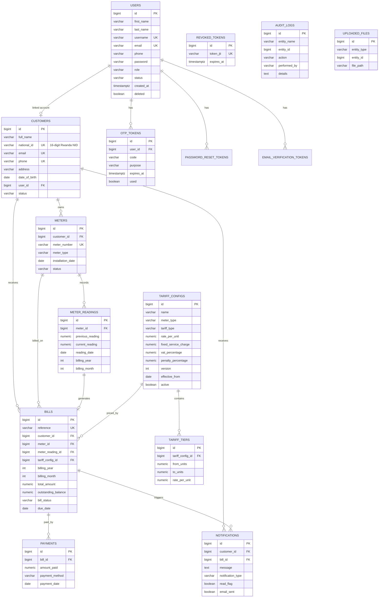

# WASAC Utility Billing — Entity Relationship Diagram

Relational database: **PostgreSQL**

## ERD source files (import into diagram tools)

| File | Use with |
|------|----------|
| [DB_SCHEMA.dbml](DB_SCHEMA.dbml) | [dbdiagram.io](https://dbdiagram.io) — paste file → instant ERD |
| [DB_SCHEMA.sql](DB_SCHEMA.sql) | DBeaver, pgModeler, draw.io, Lucidchart |
| This file (`ERD.md`) | Mermaid preview in GitHub / VS Code |

## National ID — primary customer identifier

Every customer **must** have a unique Rwanda National ID:

- **Format:** exactly **16 digits** (e.g. `119998877665544`)
- **DB:** `UNIQUE(national_id)` + `CHECK (national_id ~ '^[0-9]{16}$')` (V13)
- **API:** required on create; lookup via `GET /api/v1/customers/by-national-id/{nationalId}`
- **Duplicate rejection:** service layer + DB constraint (409 Conflict)

## Database triggers & procedures

| Object | Type | When it runs | Effect |
|--------|------|--------------|--------|
| `fn_format_billing_period` | FUNCTION | Called by trigger/SP | Formats "June 2026" label |
| `fn_notify_bill_generated` | FUNCTION | Called by trigger | Builds notification message |
| `trg_bill_generated_notification` | **TRIGGER** | `AFTER INSERT ON bills` | Inserts `BILL_GENERATED` notification (skips duplicate & missing email) |
| `sp_record_payment` | **STORED PROCEDURE** | Called from `PaymentService` | Inserts payment, updates balance, sets `PARTIALLY_PAID`/`PAID`, inserts `PAYMENT_COMPLETED` notification |

Defined in: `V8__create_billing_routines.sql` (updated in `V12__exam_validations_and_wasac_updates.sql`)

## Key constraints

| Rule | Implementation |
|------|----------------|
| Unique customer national ID (16 digits) | `UNIQUE` + `CHECK` on `customers.national_id` |
| Unique customer email / phone | `UNIQUE` on `customers` |
| One bill per meter per month/year | `UNIQUE (meter_id, billing_year, billing_month)` on `bills` |
| Unique meter number | `UNIQUE` on `meters` |
| One reading per meter per month/year | `UNIQUE (meter_id, billing_year, billing_month)` |
| Current reading > previous | `CHECK` on `meter_readings` |
| Versioned tariffs | `UNIQUE (meter_type, version)` |
| Bill notification on generation | Trigger `trg_bill_generated_notification` |
| Payment + full-pay notification | Stored procedure `sp_record_payment` |
