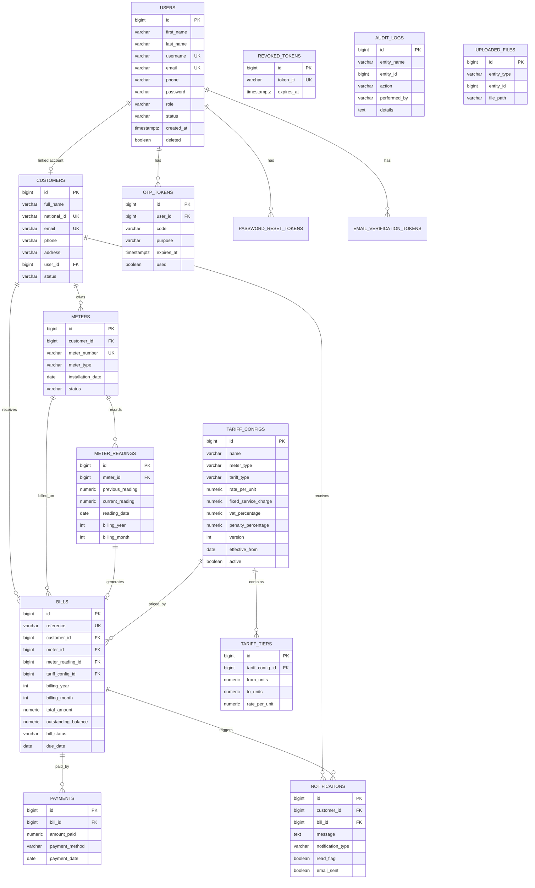

# Utility Billing System — Entity Relationship Diagram

Relational database: **PostgreSQL**

## Key constraints

| Rule | Implementation |
|------|----------------|
| Unique customer national ID / email | `UNIQUE` on `customers` |
| Unique meter number | `UNIQUE` on `meters` |
| One reading per meter per month/year | `UNIQUE (meter_id, billing_year, billing_month)` |
| Current reading > previous | `CHECK` on `meter_readings` |
| Versioned tariffs | `UNIQUE (meter_type, version)` |
| Bill notification on generation | Trigger `trg_bill_generated_notification` |
| Payment + full-pay notification | Stored procedure `sp_record_payment` |
