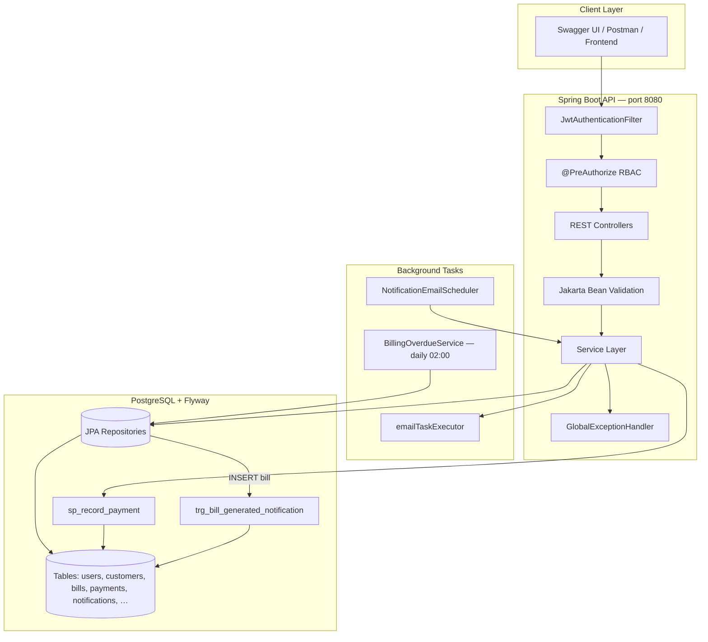
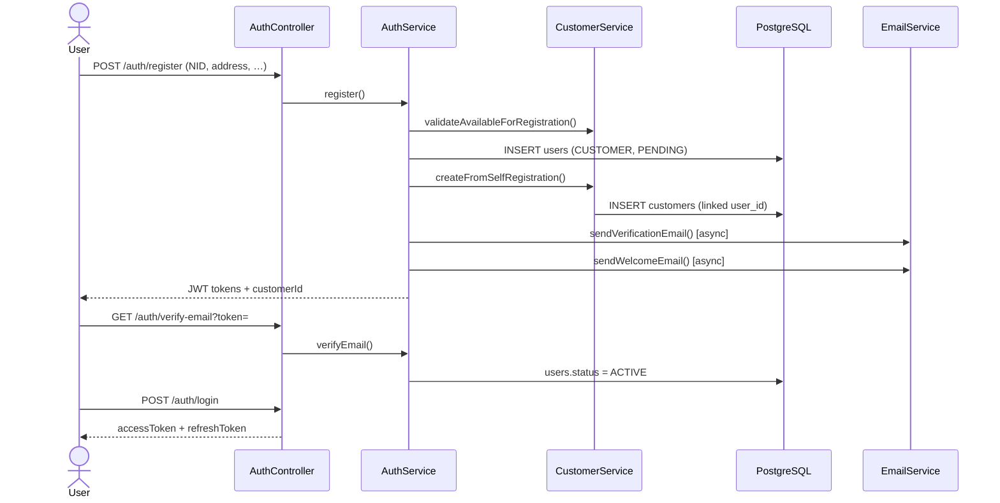
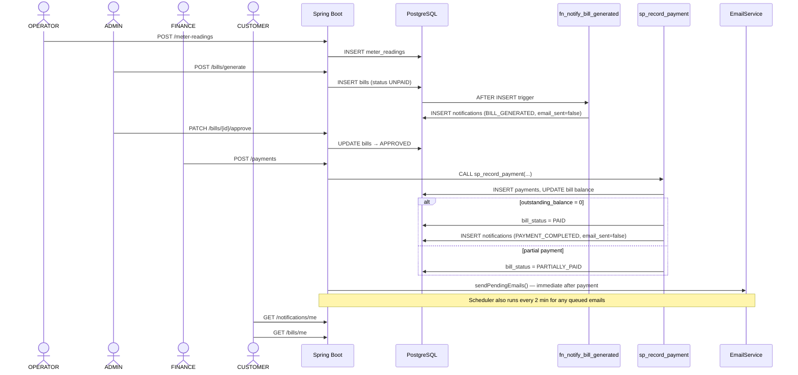
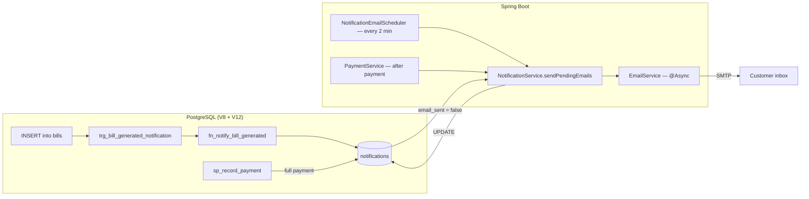
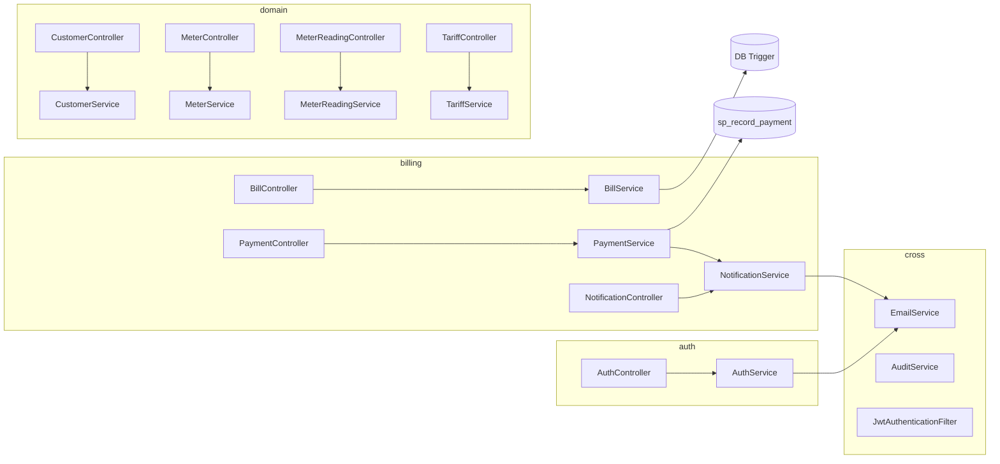

# WASAC Utility Billing — System Flow Diagrams

Use this document in presentations, viva, or exam demos. Diagrams render in GitHub, VS Code (Mermaid preview), and many markdown viewers.

---

## 1. High-level architecture



---

## 2. Authentication & onboarding flow



| Email (auth) | When sent | Template |
|--------------|-----------|----------|
| Welcome | After register | `welcome.html` |
| Email verification link | After register | `verification.html` |
| OTP | `POST /auth/send-otp` | `otp.html` |
| Password reset link | `POST /auth/forgot-password` | `password-reset.html` |
| Admin credentials | Admin creates user | `user-credentials.html` |
| Role change | Admin changes role | `role-change.html` |

---

## 3. Billing end-to-end flow (exam demo path)



### Role responsibilities

| Step | Role | Endpoint |
|------|------|----------|
| Capture reading | OPERATOR | `POST /meter-readings` |
| Generate bill | ADMIN / FINANCE | `POST /bills/generate` |
| Approve bill | FINANCE | `PATCH /bills/{id}/approve` |
| Record payment | FINANCE | `POST /payments` |
| View own bills | CUSTOMER | `GET /bills/me` |
| View notifications | CUSTOMER | `GET /notifications/me` |

---

## 4. Database routines & messaging pipeline

This is the **two-step** design required by the exam:

1. **PostgreSQL** creates in-app notification rows (`notifications` table).
2. **Spring Boot** sends HTML emails and sets `email_sent = true`.



### What the DB routines do

| Object | Type | Fires when | Creates |
|--------|------|------------|---------|
| `fn_format_billing_period` | Function | Called by trigger/SP | Human-readable month label |
| `fn_notify_bill_generated` | Function | Called by trigger | `BILL_GENERATED` notification |
| `trg_bill_generated_notification` | **Trigger** | `AFTER INSERT ON bills` | Queues bill notification |
| `sp_record_payment` | **Stored procedure** | Called from `PaymentService` | Payment row + bill update + `PAYMENT_COMPLETED` when fully paid |

Source files:
- `src/main/resources/db/migration/V8__create_billing_routines.sql`
- `src/main/resources/db/migration/V12__exam_validations_and_wasac_updates.sql` (duplicate guards, approval checks)

### Billing notification emails

| Type | Created by | Email template | Subject |
|------|------------|----------------|---------|
| `BILL_GENERATED` | DB trigger on bill INSERT | `bill-notification.html` | Your utility bill … is ready |
| `PAYMENT_COMPLETED` | `sp_record_payment` when bill fully paid | `payment-notification.html` | Payment received for bill … |

**Not implemented via DB routines** (sent directly from Java, not `notifications` table):
- Welcome, verification, OTP, password reset, admin credentials, role change

**Enum values not used:** `BILL_APPROVED`, `GENERAL` — reserved for future use.

---

## 5. How to show triggers (PostgreSQL)

Connect to your database (`javat`) and run:

### List all triggers on billing tables

```sql
SELECT
    tg.tgname AS trigger_name,
    c.relname AS table_name,
    p.proname AS function_name,
    CASE tg.tgtype & 66
        WHEN 2 THEN 'BEFORE'
        WHEN 64 THEN 'INSTEAD OF'
        ELSE 'AFTER'
    END AS timing,
    CASE tg.tgtype & 28
        WHEN 4 THEN 'INSERT'
        WHEN 8 THEN 'DELETE'
        WHEN 16 THEN 'UPDATE'
        ELSE 'MULTIPLE'
    END AS event
FROM pg_trigger tg
JOIN pg_class c ON c.oid = tg.tgrelid
JOIN pg_proc p ON p.oid = tg.tgfoid
WHERE NOT tg.tgisinternal
  AND c.relname IN ('bills', 'payments', 'notifications')
ORDER BY c.relname, tg.tgname;
```

### Show trigger function source code

```sql
SELECT pg_get_functiondef(oid)
FROM pg_proc
WHERE proname IN ('fn_notify_bill_generated', 'fn_format_billing_period');
```

### Show stored procedure source

```sql
SELECT pg_get_functiondef(oid)
FROM pg_proc
WHERE proname = 'sp_record_payment';
```

### Demo: prove trigger fired after bill generation

```sql
-- After POST /bills/generate
SELECT id, customer_id, bill_id, notification_type, email_sent, message, created_at
FROM notifications
ORDER BY created_at DESC
LIMIT 5;
```

### Demo: prove payment notification after full payment

```sql
-- After POST /payments (full amount)
SELECT n.*, b.reference, b.bill_status
FROM notifications n
JOIN bills b ON b.id = n.bill_id
WHERE n.notification_type = 'PAYMENT_COMPLETED'
ORDER BY n.created_at DESC;
```

### Flyway proof (migrations applied)

```sql
SELECT version, description, installed_on, success
FROM flyway_schema_history
WHERE version IN ('8', '12')
ORDER BY installed_rank;
```

---

## 6. Manual email dispatch (optional)

Emails are sent automatically by:
- `NotificationEmailScheduler` (every 2 minutes)
- `PaymentService` immediately after recording a payment

You can also force dispatch in Swagger:

```
POST /api/v1/notifications/send-pending-emails
Authorization: Bearer <ADMIN or FINANCE token>
```

Response: `{ "sent": 2 }` — number of emails dispatched.

Verify in DB:

```sql
SELECT id, notification_type, email_sent FROM notifications WHERE email_sent = false;
```

---

## 7. Scheduled background jobs

| Job | Class | Schedule | Purpose |
|-----|-------|----------|---------|
| Overdue penalties + disconnect | `BillingOverdueService` | Daily 02:00 | 30-day penalty, 60-day meter disconnect |
| Notification email dispatch | `NotificationEmailScheduler` | Every 2 min | Send queued bill/payment emails |

---

## 8. Layer map (package structure)



---

## 9. Quick viva checklist

- [ ] Show `V8` and `V12` migration files in IDE
- [ ] Run trigger listing SQL in pgAdmin / psql
- [ ] Generate a bill → show `BILL_GENERATED` row in `notifications`
- [ ] Approve bill → record payment → show `PAYMENT_COMPLETED` row
- [ ] Show `email_sent` flipping to `true` after scheduler or manual dispatch
- [ ] Open `templates/email/bill-notification.html` and `payment-notification.html`
- [ ] Walk through this diagram file in the presentation
