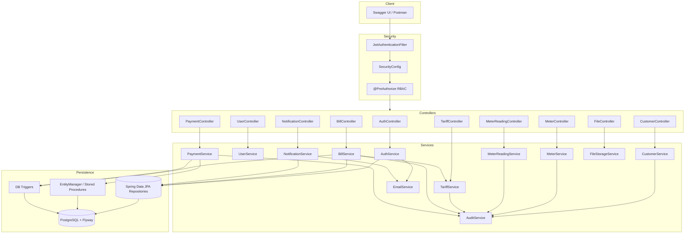

# Utility Billing System — Spring Boot Flow Diagram

## Request lifecycle

1. **Authentication** — `POST /api/v1/auth/register|login` returns JWT access + refresh tokens.
2. **Authorization** — Every protected request passes through `JwtAuthenticationFilter` (validates signature, expiry, blacklist, token type).
3. **Validation** — DTOs validated with Jakarta Bean Validation; errors handled by `GlobalExceptionHandler`.
4. **Business logic** — Service layer enforces domain rules (readings, tariffs, inactive customers, payments).
5. **Persistence** — JPA repositories persist entities; payments call `sp_record_payment`; bill insert fires notification trigger.
6. **Messaging** — `EmailService` sends HTML emails asynchronously; `NotificationService` dispatches pending notification emails.
7. **Audit** — `AuditService` records create/update/delete actions in `audit_logs`.

## Role matrix

| Role | Capabilities |
|------|----------------|
| ADMIN | Users, tariffs, customers, meters, bill approval |
| OPERATOR | Capture meter readings |
| FINANCE | Approve bills, record payments |
| CUSTOMER | View own bills, payments, notifications |
